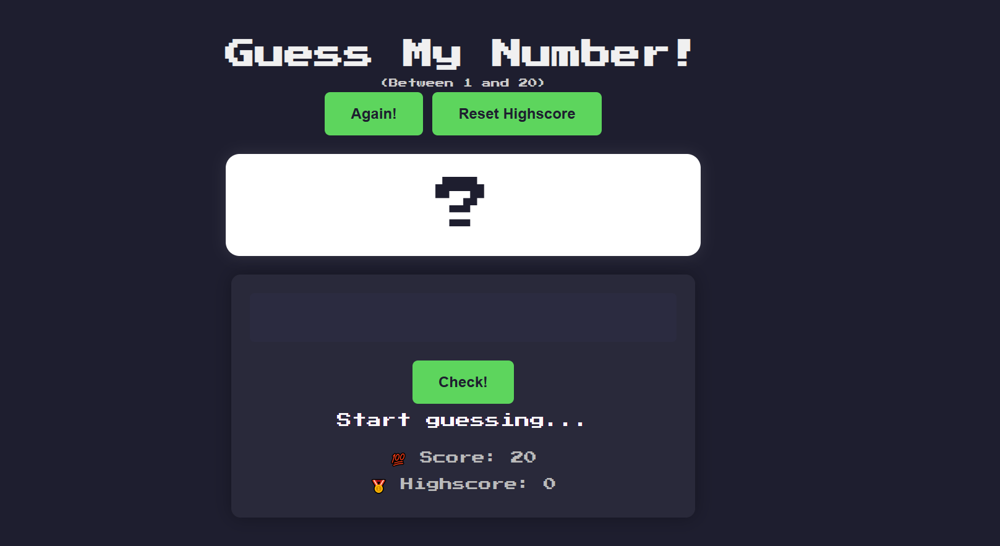
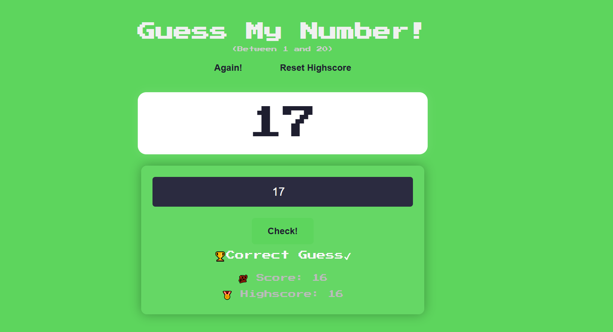

# 🎯 Guess The Number Game

A fun and interactive number guessing game built with HTML, CSS, and JavaScript. Try to guess the secret number between 1 and 20!

---

## 🔥 Features

- 🧠 Smart guess hints (too high / too low)
- 💯 Score tracking
- 🏆 Highscore saved using localStorage
- 📱 Fully responsive layout
- 💫 Simple animations for feedback

---

## 🎮 How to Play

1. Enter a number between 1 and 20 in the input field.
2. Click the **"Check!"** button.
3. The game will tell you if your guess is too high or too low.
4. Try to guess correctly before your score hits 0.
5. Click **"Again!"** to restart the game.

---

## 🚀 Demo

👉 [Play Now](https://your-username.github.io/guess-the-number-game/)

---

## 🖼 Screenshots

### Initial View

### Correct Guess

---

## 🧑‍💻 Author

**Syed Bilal**  
📧 syedbilal.dev27@gmail.com
🔗 [GitHub Profile](https://github.com/iamsyedbilal)

---

## 🛠 Tech Stack

- HTML5
- CSS3 (Flexbox + Animations)
- JavaScript (DOM, localStorage)

---

## 📂 Project Structure

guess-the-number/
│
├── index.html
├── style.css
├── script.js
├── README.md
└── screenshots/
├── initial.png
└── win.png
